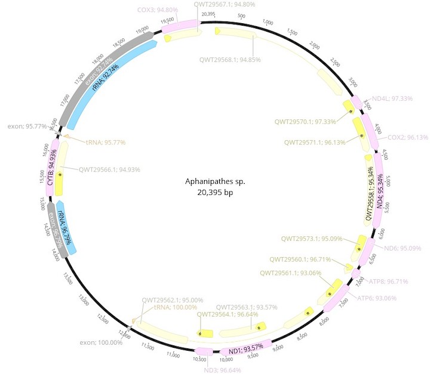

# Annotating *Aphanipathes* sp. 

**Objective:** Annotate *Apahnipathes* sp.(130-W-Maui) collected in the Au'Au Channel.

**Methods:**

1. Inspect large_contigs_130.fasta produced by SPAdes.
2. Export as a .fasta file and then BLAST NODE_1_length_16557_cov_5.095557 and NODE_3_length_14543_cov_8.299022.
3. BLAST results revealed NODE_1_length_16557_cov_5.095557 to be the most appropriate candidate for downstream analysis because it aligned with antipatharians. Results yielded 100% Per. Ident to all *Aphanipathes* partial mitogenome sequences.
4. BLAST results yielded the following: Query Cover 94%, Per. Ident 92.70% to *Stichopathes* sp. SCBUCN-8850 (MZ157399), Query Cover 94%, Per. Ident 92.21% to (JX023266), and 92% to *Stichopathes* sp. SCBUCN-8849 (MZ157400). Other matches were 80% or less for both Quer Cover and Per. Ident.
5. Download relevant *Apahnipathes* material from GenBank; place these files into the "Reference Features" subfolder labeled "antipatharians".
6. In Geneious Prime: "Find Repeats". No repeats were found, further suggesting this is a partial mitochondrial genome.
7. Create two iterations: one will contain Mitos2 dictated annotations and the other will be results of annotations that were transferred from library.
8. Submit .fasta file to Mitos2 (job settings: RefSeq 89 Metazoa, Genetic code: 4 Mold). 
9. Transfer annotations from database. Annotations revealed an alignment in the reverse direction. Created a reverse compliment.
10. Annotations didn't appear to transfer well (low similarity 90%). Opted to explore mapping trimmed reads to reference genome.
11. scp "trimmed_reads" for 130, input 130.F.fq.gz and 130.R.fq.gz into Geneious separately, paired them and then mapped these reads to MZ157399. (See Figure 1)
12. A consensus sequence of 20, 395 bp was generated.
13. This consensus sequence was BLASTed. Top 3 results were as follows: 98% Query Cover, 92.61 Per. Ident to (MZ157399.1), 97% Query Cover, 91.48 Per. Ident to (JX023266.1), 96% Query Cover, 92.42 Per. Ident to (MZ157400.1). All partial *Aphanipathes* scored either 100 Per. Ident or >99.%.

14. Annotations were transferred (via Geneious Prime) to this consensus sequence following same protocol above. Note that percent identical is lower in these annotations. (See Figure 2)
15. Submitted this consensus sequence to Mitos2 as a new job.

Figure 1. Trimmed MiSeq PE reads mapped to Stichopathes sp. SCBUCN-8850 (MZ157399).   

Figure 2. Similarity (shown in percentages) between consensus sequence and transferred annotations.