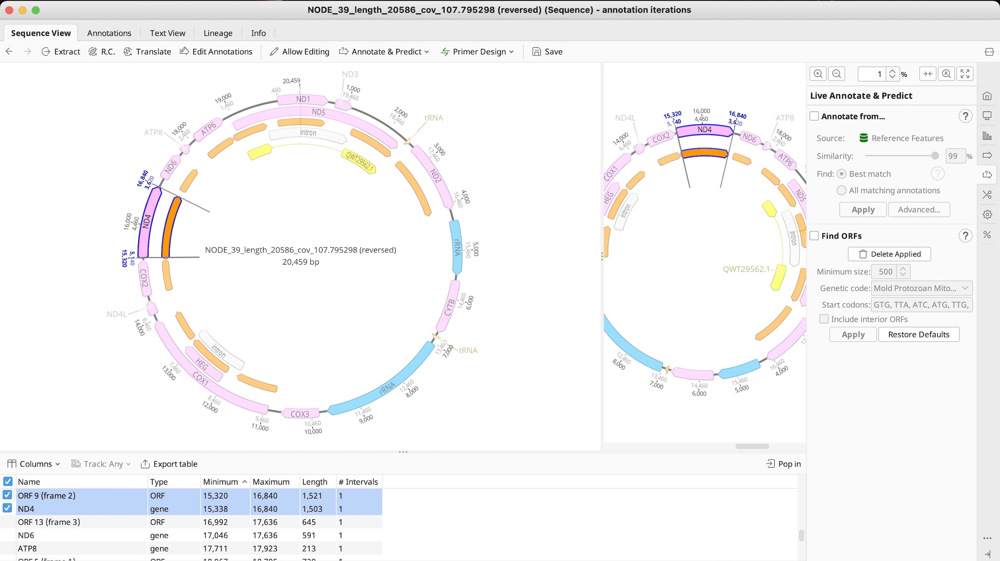

# Annotating *Stichopathes* sp

**Objective:** Annotate *Stichopathes* sp. (180-W-Kaua) collected at Amber's Arches off of Kauai.

**Methods:**

1. BLAST contigs.fasta from SPAdes output.
2. Select best candidate for downstream analysis (NODE_39_length_20586_cov_107.795298).
3. Find repeats at start and end then remove and circularize the linear sequence.
4. Utilizing Genious Prime, transfer annotations from database.
5. Annotations revealed a reverse compliment was needed so "Reverse Compliment" in the "Sequence" tab was selected.
6. Employ "Find ORFs" in Geneious Prime to locate start codons.
7. Input "200" for "Minimum size"; select "Mold Protozoan Mitochondrial transl_table 4" for "Genetic code". This will auto-populate the relevant start codons.
8. Inspect sequence (with the highlighted ORFs). Though Geneious transfers annotations it is imperative that manual inspection of the sequence is performed. You may need to adjust the annotation so that the annotation contains the correct start codon. See example below.

9. Submit .fasta file to Mitos2 (job settings: RefSeq 89 Metazoa, Genetic code: 4 Mold). Compare output to annotations transferred from Stichopathes sp. SCBUCN-8850 (MZ157399).

10.  Rules for annotations were as follows:

>Transferred annotations take priority; Mitos2 serves to verify these annotations. In certain cases ORFs revealed subtle differences between transferred annotations and Mitos2 annotations. In cases where Geneious Prime and Mitos2 yielded the identical results, but ORF stated something different, ORF Finder result was ignored.

